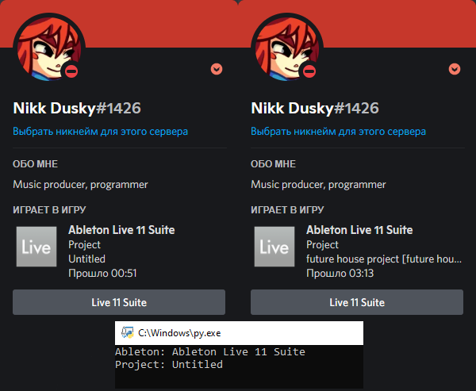
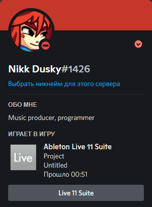
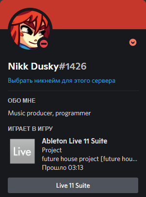

# Ableton Live Suite 11 Discord Presence

Ableton Live Suite 11 Discord Presence

## Requirements

```
Python 3
pip install pypresence
```

## About

Simple, beautiful.

## Notes

Program doesn't like "-" in project name's, because i use split method.


## Screenshots



